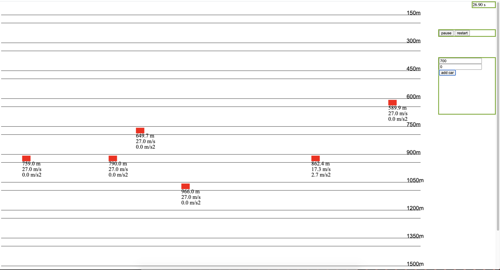
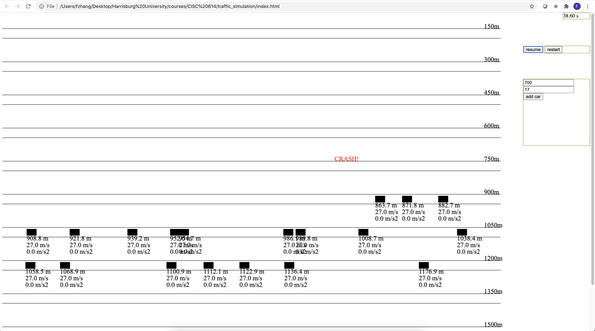

Highway Simulation
===
Run simulation locally
---
Just drag `index.html` into your browser!

Local dev
---
cd into the project directory
```
> brew install node ( in case you don't have npm)
> npm install -g watchify
> watchify main.js -o bundle.js -v (in order to automatically update bundle.js)
```

ScreenShot
---

